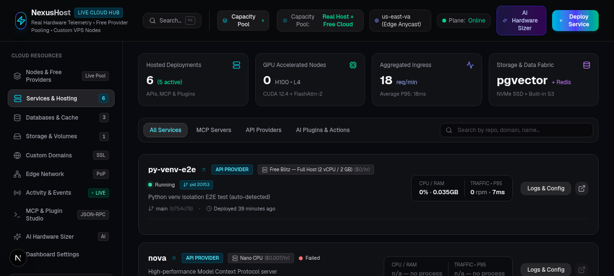
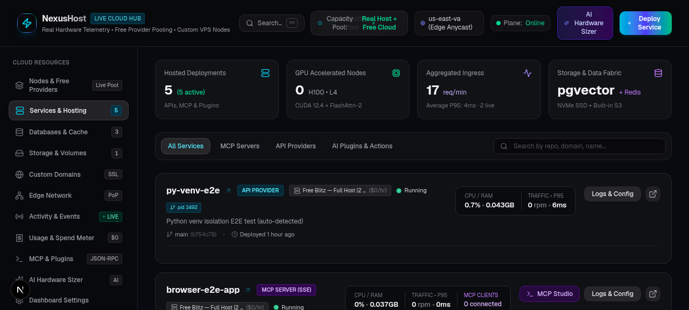
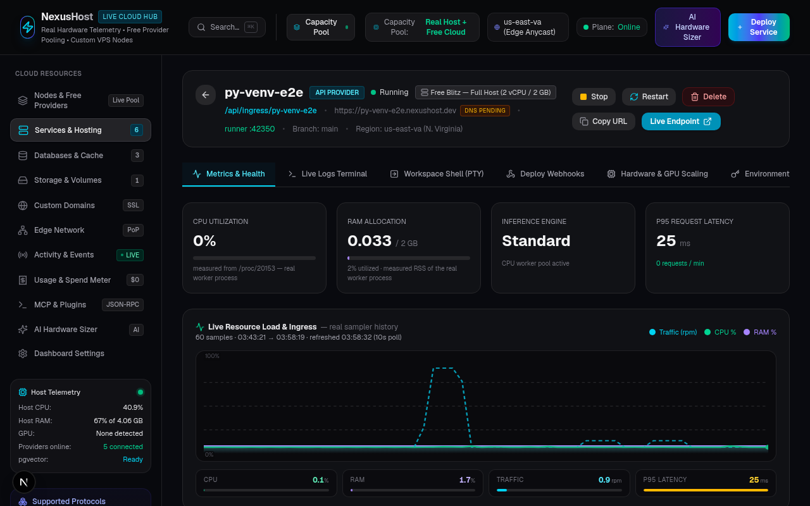
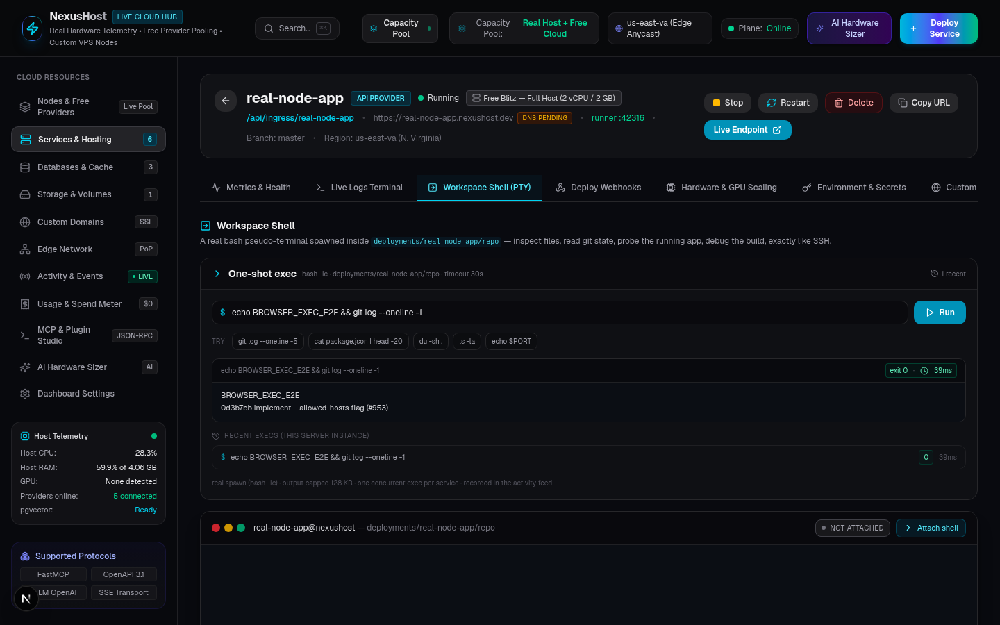
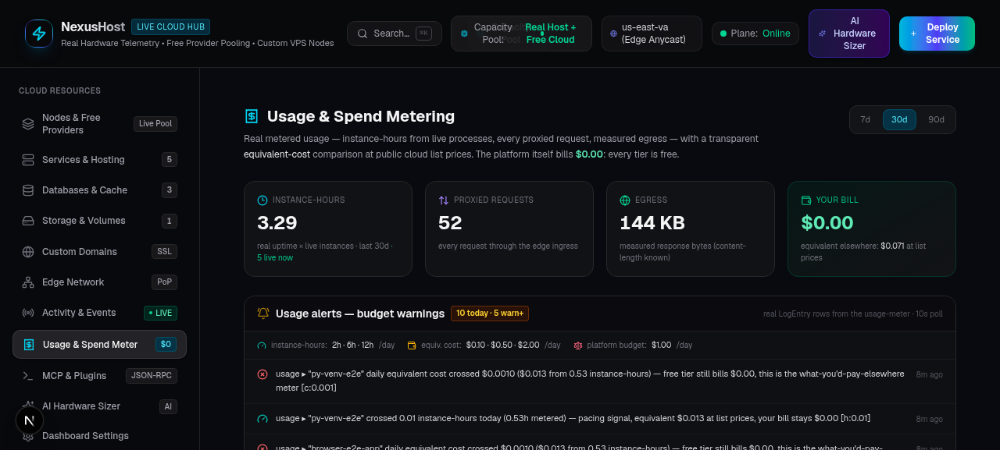
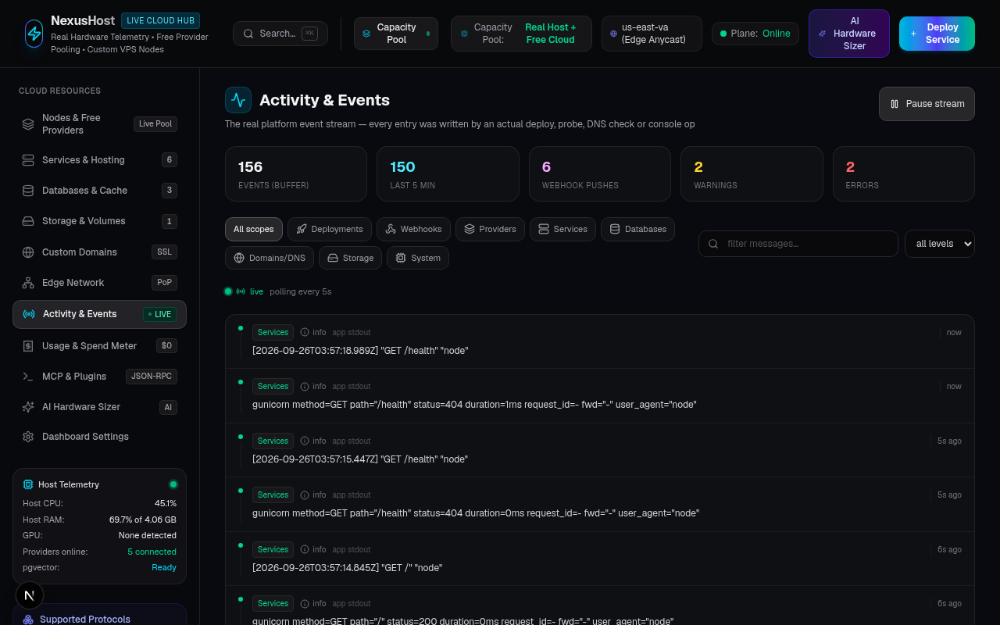

# Hoster

**A real, self-hosted PaaS control plane.** Deploy any Git repository, get a real running process — not a simulation. Real `git clone`, real dependency installs, real builds, real child processes with `/proc`-measured CPU/RAM, real HTTP traffic metrics, real web terminals, real autoscaling.

Built as a single Next.js application: the control plane UI, the REST API, the edge router, and the deployment engine all live in one codebase, with one companion micro-service for PTY terminals.



---

## Table of Contents

- [Why this exists](#why-this-exists)
- [Feature highlights](#feature-highlights)
- [Architecture](#architecture)
- [Tech stack](#tech-stack)
- [Quickstart](#quickstart)
- [Using Hoster](#using-hoster)
  - [Deploying a service](#deploying-a-service)
  - [Custom domains and edge routing](#custom-domains-and-edge-routing)
  - [Push-to-deploy webhooks](#push-to-deploy-webhooks)
  - [Workspace shell and one-shot exec](#workspace-shell-and-one-shot-exec)
  - [Autoscaling](#autoscaling)
  - [Usage metering and budget alerts](#usage-metering-and-budget-alerts)
- [Configuration](#configuration)
- [API reference](#api-reference)
- [Data model](#data-model)
- [Design principles](#design-principles)
- [Verified end-to-end scenarios](#verified-end-to-end-scenarios)
- [Project structure](#project-structure)
- [Known limitations and roadmap](#known-limitations-and-roadmap)
- [License](#license)

---

## Why this exists

Most "PaaS clones" render dashboards full of numbers that came from a random-number generator. Hoster is the opposite: **every number on screen is measured**. When the dashboard shows a P95 latency, it is the P95 of actual proxied requests. When it shows a worker's RAM, it is read from `/proc/<pid>`. When a deploy fails, the log carries the real `stderr` tail from the real pipeline that ran.

The platform was deliberately rebuilt around one rule: *if it can't be measured, it isn't shown.*

## Feature highlights

| Area | What it does | How it stays real |
|---|---|---|
| **Deployer** | Deploy from any Git URL | `git clone` → stack auto-detect (Node / Python / static) → install (`bun` → `npm` fallback; `uv` → `pip` fallback into a per-service venv) → optional build → real detached child process → HTTP readiness probe. Real commit hash extracted from the clone. |
| **Stack detection** | Node, Python, static sites | `package.json` → Node (reads `start`/build scripts); `requirements.txt` → Python (prefers `app.py`/`main.py`, then Heroku-style `Procfile web:`, then `manage.py` with automatic Django `collectstatic` build step); otherwise served as static. |
| **Edge routing** | `Host: <name>.nexushost.dev` → your app | Next.js `proxy.ts` host-header routing to `/api/ingress/<name>/*`; custom domains resolved DB-backed via `/api/edge/resolve`. Works on any host with wildcard DNS — no code change. |
| **Readiness semantics** | Heroku-style | Any HTTP answer counts as up — app-level 5xx are the app's own and visible in its logs. |
| **Telemetry** | CPU / RAM / requests / p95 | Real request counters and P95 from a live ring (recorded per proxied request); CPU/RAM parsed from `/proc/<pid>` (resolves `bash` → `bun` → `node` to the actual worker). |
| **Providers** | 5 built-ins: local node, Hugging Face Spaces, Render, Fly.io, Koyeb | Connected tokenless via public endpoint probes (any HTTP answer = live; 401/404 counts). Auto re-verify watchdog sweeps every 30 s; tokens never leave the server (`hasToken` + last-4 only). |
| **Restart resilience** | Deploys survive control-plane restarts | Apps spawn detached (own process group), logs go to `deployments/<name>/app.log` on raw fds (restart-proof), an orphan-adoption watchdog re-binds surviving processes to their service records with metrics intact, and bounded self-healing (max 3 relaunches / 2 h per service) recovers genuinely dead processes. |
| **Web terminals** | Real per-service PTY shells | `node-pty` bash sessions in the service workspace via a socket.io micro-service, with guardrails: workspace validation, max 6 sessions (2/service), 30-min idle reaper, PTY killed on disconnect, sessions logged to the activity feed. |
| **One-shot exec** | Run a command in a service workspace | `bash -lc` spawn with 2 000-char input cap, 5–60 s timeout, 128 KB output caps, one concurrent exec per service, and rolling-window rate limits (60/h per service, 240/h platform-wide). Full history ring (last 25 per service). |
| **Autoscaling** | Process-level scale-out | Real worker processes spawned/killed on their own ports, round-robin ingress across primary + workers, aggregated `/proc` metrics, CPU-history-driven policy (65 % up / 12 % down hysteresis over a 5-min window, 3-min cooldown, hard cap 1+4 instances). |
| **Webhooks** | Push-to-deploy | GitHub-compatible receiver with timing-safe HMAC-SHA256 signature verification (`x-hub-signature-256`), repo-URL normalization (protocol/`.git`/auth-insensitive), branch filters, in-progress guards, plus a generic token-authenticated endpoint for GitLab/Gitea/cron. Full delivery history. |
| **Usage metering** | Instance-hours, requests, egress | 15 s sampler flushes real instance-seconds × live instance count (including scale-out workers), per-request counts, and content-length-measured egress into daily `UsageDaily` rows. Equivalent-cost view at public list-price ballpark — the platform itself bills $0.00. |
| **Budget alerts** | Threshold ladders on real spend | Instance-hour ladders (2/6/12 h), per-service equivalent-cost ladders ($0.10/$0.50/$2.00), platform daily budget ($1 warn / $2 error) — restart-safe dedupe, all env-tunable. |
| **Cost projection** | 30-day outlook | Projects current footprint and configured autoscaler max over 720 h with live burn-rate, from real instance counts. |
| **Activity feed** | Global real event stream | Deploys, watchdog transitions, DNS checks, DB ops, webhook deliveries, exec runs, terminal sessions, usage alerts — scope chips, level filters, live search, pause/resume, smart app-log budgets so failures always stream. |
| **Databases & storage** | SQL + Redis consoles, volumes, buckets | Real SQL console queries, real Redis `SET`/`GET` round-trips with real keyspace/memory measurements, volumes as real on-disk directories with usage measured by walking the filesystem. |
| **Command palette** | `Ctrl/⌘ + K` | Fuzzy search across services, all views, and quick actions (deploy, open shell, stop, restart) with per-service actions. |
| **MCP inspector & agent API** | `/api/mcp/execute`, `/api/agent/*` | Programmatic control of the platform, plus an AI architecture advisor modal in the UI. |



## Architecture

```
                        ┌────────────────────────────────────────────────┐
                        │              Hoster control plane              │
                        │           (Next.js 16, port 3000)              │
                        │                                                │
  Host: app.nexushost.dev                                              │
  Host: my-custom-domain.com ──► src/proxy.ts (edge host router)        │
                        │              │                                 │
                        │              ▼                                 │
                        │   /api/ingress/<name>/*  ── round-robin ──┐   │
                        │                                        │   │
                        │   REST API  /api/services, /api/webhooks, │   │
                        │   /api/usage, /api/edge, /api/logs, ...   │   │
                        │                                        │   │
                        │   lib/hoster/*                          │   │
                        │   ┌──────────────────────────────┐      │   │
                        │   │ deployer    │ real pipeline   │      │   │
                        │   │ telemetry   │ /proc metrics   │      │   │
                        │   │ autoscaler  │ CPU policy      │      │   │
                        │   │ webhooks    │ HMAC verify     │      │   │
                        │   │ usage(-alerts) │ metering     │      │   │
                        │   │ exec / edge / providers / ...  │      │   │
                        │   └──────────────────────────────┘      │   │
                        │              Prisma ◄── SQLite           │   │
                        └──────────────┬───────────────────────────┼───┘
                                       │ spawn / adopt / kill       │
                     ┌─────────────────┼───────────────┐   ┌───────┴────────┐
                     ▼                 ▼               ▼   ▼                ▼
           deployments/appA     deployments/appB   scale-out          deployments/<name>/
             (detached proc)      (detached proc)   workers            app.log (fd logs)
                     ▲                 ▲               ▲                ▲
                     └───────── orphan adoption & bounded self-heal ────┘

                        ┌──────────────────────────────┐
                        │  terminal-service (port 3031) │
                        │  socket.io + node-pty         │◄── xterm.js UI
                        │  real bash PTYs in workspaces │
                        └──────────────────────────────┘
```

Key properties:

- **Deployed apps are independent OS processes** — spawned detached in their own process group. The control plane can crash, restart, or be redeployed and the apps keep serving.
- **Logs are files first** — app stdout/stderr stream to `deployments/<name>/app.log` via raw file descriptors, so logs survive control-plane restarts. A rate-limited tailer streams them into the database buffer for the live view, and the full file is browsable/downloadable from the UI.
- **Watchdogs** — deployment watchdog (adoption, stuck-deployment recovery, self-heal), provider watchdog (30 s), host sampler (15 s, records `MetricSample` rows and flushes usage metering), autoscaler sweep (45 s).

## Tech stack

| Layer | Choice |
|---|---|
| Framework | Next.js 16 (App Router, Turbopack), React 19, TypeScript 5 |
| Styling | Tailwind CSS 4 + shadcn/ui (New York) + Lucide icons |
| Data | Prisma 6 + SQLite |
| Server state | TanStack Query 5 |
| Client state | Zustand |
| Charts | Recharts |
| Terminal | xterm.js (+ fit addon), node-pty, socket.io |
| Command palette | cmdk |
| Validation | Zod |
| Runtime | Bun (control plane), Node.js ≥ 24 (terminal service — node-pty requires node's `fork()`) |

## Quickstart

Prerequisites:

- [Bun](https://bun.sh) (runs the Next.js control plane)
- Node.js ≥ 24 (runs the terminal service — `node-pty` needs real `fork()`)
- `git`, and `python3` with [`uv`](https://docs.astral.sh/uv/) for fast Python deploys (optional, falls back to `pip`)

```bash
# 1. Install control-plane dependencies
bun install

# 2. Configure the environment
cp .env.example .env
#    edit DATABASE_URL to a path you like

# 3. Create the database schema
bun run db:push

# 4. Start the control plane (port 3000)
bun run dev

# 5. In a second shell — the terminal service (port 3031)
cd mini-services/terminal-service
bun install
bun run dev        # node --watch index.mjs
```

Open `http://localhost:3000`. Deploy something:

```bash
curl -X POST http://localhost:3000/api/services \
  -H 'content-type: application/json' \
  -d '{
        "name": "my-first-app",
        "repoUrl": "https://github.com/http-party/http-server",
        "tier": "free-blitz"
      }'
```

Then hit it through the edge:

```bash
curl -H "Host: my-first-app.nexushost.dev" http://localhost:3000/
# or directly:
curl http://localhost:3000/api/ingress/my-first-app/
```

Or just use the dashboard — every feature above has a full UI.

## Using Hoster

### Deploying a service

The deploy pipeline, in order:

1. `git clone` into `deployments/<name>/repo` (progress streams to the live log view)
2. Stack auto-detection — Node (`package.json`), Python (`requirements.txt`, with `Procfile`/`manage.py`/`app.py` awareness and Django `collectstatic`), or static
3. Dependency install — `bun install` (falls back to `npm ci`); Python: `uv venv` + `uv pip install` (falls back to `python3 -m venv` + `pip`), installs isolated into a per-service `.venv`
4. Optional build step (`next build`, `vite build`, `collectstatic`, …)
5. Spawn: `bash -lc <start>` in its own process group, detached, stdout/stderr → `deployments/<name>/app.log`
6. HTTP readiness probe (any HTTP answer = up)
7. On success the real commit hash, PID, port, and final start command are persisted (the start command is what makes the service re-launchable, adoptable, and scalable)

Stop/start/restart are real lifecycle operations: stop kills the exact process tree (walking `/proc` children, never collateral group-kills), start replays the full pipeline.



### Custom domains and edge routing

- Host-header routing works out of the box: any request with `Host: <service>.nexushost.dev` is routed to that service (including scale-out round-robin).
- Add a custom domain in the UI: Hoster runs a **real DNS check** (A/CNAME lookups, real resolver errors surfaced), then routes `Host: <your-domain>` requests to the service — same semantics as a CDN vhost, so it works even before DNS propagates if you send the Host header.
- The Edge view shows the routing table, real host telemetry, and live upstream provider latency probes (HEAD requests, milliseconds, with trend indicators against the previous probe).

### Push-to-deploy webhooks

Each service gets a unique secret (`wh_...`). Configure GitHub:

1. Service → **Deploy Webhooks** tab → copy the endpoint URL and secret
2. GitHub repo → Settings → Webhooks → Add webhook
3. Payload URL = the endpoint, Secret = the service secret, Event = push

On every push, Hoster verifies the `x-hub-signature-256` HMAC (timing-safe), matches the repo URL (protocol/`.git`/credentials-insensitive), filters by branch, kills the old process tree, and re-runs the full real pipeline. Delivery history (accepted / skipped / rejected, with reasons) is available per-service and in the global activity feed.

Non-GitHub CI (GitLab, Gitea, cron, `curl`):

```bash
curl -X POST "http://localhost:3000/api/webhooks/deploy?service=my-first-app&token=<secret>"
```

### Workspace shell and one-shot exec

- **Workspace Shell tab** — a real bash PTY (xterm.js in the browser, `node-pty` on the server) inside the service's deploy workspace. Even failed deploys can get a shell — the workspace survives, so you can debug why the readiness probe failed.
- **One-shot exec** — run a single command with output, exit code, and duration returned; every run is rate-limited and recorded in the activity feed. Exposed in the UI and via `POST /api/services/<id>/exec`.
- **Terminal session manager** (Settings) — live list of all PTYs across the platform with PID, age, and idle time; operator kill.



### Autoscaling

Real process-level autoscaling:

- Scale out spawns **real worker processes** of the same service on their own ports (collision-safe allocation), with identical env contract and fd-based log files; scale in reaps them.
- Ingress load-balances round-robin across primary + workers; telemetry aggregates `/proc` CPU/RAM across all of them.
- The policy engine reads real `MetricSample` history: average CPU over a 5-minute window above 65 % scales up, below 12 % scales down, with a 3-minute cooldown and a hard cap of 1 + 4 instances.
- Manual control in the Hardware tab (scale out/in buttons, min/max bounds editor) hits the same real API (`PATCH /api/services/<id>` action `scale`).

### Usage metering and budget alerts

- A 15 s sampler accumulates **real instance-seconds** (live instance count × time, workers included), **request counts**, and **egress bytes** (content-length measured at the ingress) into daily per-service rows.
- The Usage & Spend view shows daily instance-hours and request charts, per-service tables, and an **equivalent-cost** view (what this footprint would cost at $0.008/vCPU-hr + $0.004/GB-RAM-hr public list prices — the platform itself bills $0.00, and the UI says so).
- Budget alerts fire as threshold ladders are crossed (instance-hours, per-service cost, platform daily budget), deduplicated across restarts, tunable via environment variables.
- A 30-day cost projection card compares current footprint vs configured autoscaler max, with today's live burn-rate.



## Configuration

`.env`:

| Variable | Default | Meaning |
|---|---|---|
| `DATABASE_URL` | — | SQLite file URL (required) |
| `NX_USAGE_ALERT_HOUR_THRESHOLDS` | `2,6,12` | Instance-hour alert ladder (comma-separated) |
| `NX_USAGE_ALERT_COST_THRESHOLDS` | `0.1,0.5,2.0` | Equivalent-cost alert ladder in $ (comma-separated) |

Free-tier hardware specs are **measured from the actual host** at runtime (vCPU count, memory), so the tier catalogue reflects the machine you run on. The `/api/hardware-specs` endpoint serves the measured numbers and the UI displays them with "measured live" badges.

## API reference

| Method | Route | Purpose |
|---|---|---|
| `GET`/`POST` | `/api/services` | List / deploy services |
| `GET`/`PATCH`/`DELETE` | `/api/services/<id>` | Inspect; actions: `start`, `stop`, `restart`, `scale`, `rotate-webhook`; delete |
| `GET` | `/api/services/<id>/history` | Real metric samples (CPU/RAM/rpm/p95) for charts |
| `GET` | `/api/services/<id>/log-file` | On-disk `app.log` reader — `?tail=N`, `?download=1` |
| `POST`/`GET` | `/api/services/<id>/exec` | Run one-shot command / exec history |
| `ANY` | `/api/ingress/<name>/*` | Edge ingress to a deployed service |
| `GET` | `/api/edge` | Edge PoPs, routing table, upstream latency probes |
| `GET` | `/api/edge/resolve` | Custom-domain resolution (DB-backed) |
| `POST` | `/api/webhooks/github` | GitHub push receiver (HMAC-verified) |
| `POST` | `/api/webhooks/deploy` | Generic CI trigger (token auth) |
| `GET` | `/api/webhooks/deliveries` | Webhook delivery history |
| `GET`/`POST` | `/api/databases`, `/api/databases/query`, `/api/databases/test-connection` | SQL databases + console |
| `POST` | `/api/redis/execute` | Redis console |
| `GET`/`POST` | `/api/volumes`, `/api/volumes/<id>` | Volumes (real on-disk directories) |
| `GET`/`POST` | `/api/buckets`, `/api/buckets/<id>` | Object storage buckets |
| `GET`/`POST` | `/api/domains`, `/api/domains/<id>` | Custom domains (real DNS checks) |
| `GET`/`PATCH` | `/api/providers`, `/api/providers/<id>` | Providers (token-safe serialization) |
| `GET` | `/api/logs` | Activity feed (scope/level filters) |
| `GET` | `/api/usage` | Usage totals, per-service metering, cost projection |
| `GET` | `/api/hardware-specs` | Measured tier catalogue + host info |
| `GET` | `/api/system/metrics`, `/api/system/history`, `/api/system/realtime-node` | Host telemetry |
| `POST` | `/api/mcp/execute` | MCP tool execution |
| `GET`/`POST` | `/api/agent/heartbeat`, `/api/agent/install` | Agent API |
| `GET` | `/api/advisor` | AI architecture advisor |

The terminal service (port 3031) speaks socket.io at path `/` with events for attach/detach, input/output, and session management (`list-sessions`, `kill-session`).

## Data model

Prisma models (SQLite): `Service` (runtime state incl. workers + start command, webhook secret), `ServiceData`, `PostgresDb`, `RedisDb`, `Volume`, `Bucket`, `Domain`, `Provider` (tokens server-side only), `WebhookDelivery`, `UsageDaily`, `MetricSample`, `LogEntry`.

## Design principles

1. **Real over simulated** — no fake timers, no PRNG metrics. If a value can't be measured, the UI says "n/a — no process" instead of showing a fake zero.
2. **Restart resilience** — apps outlive the control plane. Detached process groups, file-descriptor logs, orphan adoption, bounded self-healing (chronic crashers stay failed — no infinite loops).
3. **Honest numbers** — equivalent-cost views are labeled as comparisons; usage history starts when metering started (no backfill); the platform bills $0.00 and the UI displays exactly that.
4. **Guardrails everywhere** — exec timeouts, output caps, rate limits, session caps, input validation, timing-safe secret comparisons.
5. **Failures carry evidence** — failed deploys show the real `stderr` tail; failed DNS checks show the resolver error; failed probes show what actually happened.



## Verified end-to-end scenarios

Every capability above has been verified end-to-end on a live machine, including:

- **Node deploy**: `http-party/http-server` — full pipeline, running on the real cloned commit, live logs (clone progress → npm install → boot), ingress 200.
- **Static deploy**: `mdn/beginner-html-site-styled` — served through both host-header routing and the ingress path.
- **Python deploy**: `heroku/python-getting-started` (Django + Gunicorn) — uv venv, dependency install, `Procfile` detection, `collectstatic`, Gunicorn boot, ingress 200 serving the real app.
- **Lifecycle**: stop → 503, start → full re-clone and re-serve with a fresh PID; restart race (status flips before kill) guarded.
- **Restart resilience**: app processes survived full control-plane restarts and were adopted with metrics, health checks, and log streaming intact; crash-interrupted deployments were detected and re-run.
- **Webhooks**: simulated signed GitHub push → 202 → full real redeploy (fresh PID, new commit); bad signature rejected; branch mismatch skipped; ping answered; generic curl + Bearer both trigger; deliveries recorded.
- **Autoscaling**: scaled to 3 instances (2 real workers serving HTTP on their own ports), 6 round-robin ingress requests all 200, scaled back to 1 (workers reaped).
- **Terminal**: PTY attach through the gateway, real prompt, real `git log` output in the workspace, cross-tab session list and operator kill.
- **Exec**: exit 0 with real commit output, timeout kill, non-zero exit with real stderr, history ring, rate limiting.
- **Usage**: real requests + egress metered through ingress, instance-hours accumulating, budget alerts fired/deduped/surviving restarts, cost projection matching live instance counts.
- **Quality gates**: `eslint` clean, `tsc` clean, zero console errors across all views, mobile (375 px) no horizontal overflow.

## Project structure

```
├── docs/screenshots/              # README screenshots
├── mini-services/
│   ├── launch.py                 # double-fork daemon launcher
│   └── terminal-service/          # socket.io + node-pty PTY service (port 3031, Node runtime)
├── prisma/schema.prisma          # data model
├── src/
│   ├── proxy.ts                  # edge host-header router (Next 16 proxy convention)
│   ├── app/api/                  # REST API routes (services, ingress, webhooks, usage, ...)
│   ├── components/hoster/        # control-plane UI views
│   └── lib/hoster/
│       ├── deployer.ts           # the real deploy pipeline + adoption/self-heal/scale-out
│       ├── providers.ts          # provider registry + tokenless liveness + watchdog
│       ├── telemetry.ts          # real metrics collection
│       ├── procstats.ts          # /proc parsing
│       ├── autoscaler.ts         # CPU-history policy engine
│       ├── webhooks.ts           # HMAC verification + redeploy trigger
│       ├── exec.ts               # one-shot exec with guardrails
│       ├── usage.ts / usage-alerts.ts  # metering + budget alerts
│       ├── edge.ts               # DNS resolution + latency probes
│       ├── hardware-specs.ts     # host-measured tier catalogue
│       ├── runtime.ts / server.ts / types.ts
│       └── metrics.ts
├── deployments/<name>/           # (runtime) repos + app.log per service
└── volumes-data/<name>/          # (runtime) volume backing dirs
```

## Known limitations and roadmap

- **TLS / wildcard DNS**: host-header routing is code-complete; on this sandbox only the dashboard hostname is forwarded. On a host with wildcard DNS + a TLS terminator (e.g. Caddy), `*.nexushost.dev` routing activates automatically. Real edge TLS is the top roadmap item.
- **Usage history starts at first metering** — no backfill, by design (honesty over pretty charts).
- **Python ML repos**: `torch`-class dependency trees are heavy without a shared cache; `uv` mitigates, venv-per-service isolation is intentional.
- **Scale-out caps**: bounded (1+4 workers) to protect small hosts from OOM; the cap is a one-line constant.
- Roadmap: TLS via Caddy at the edge, webhook → autoscale coordination (pre-traffic scale-up), operator-configurable budget thresholds in the DB (currently env vars), webhook fan-out on error-level usage alerts, uv-everywhere cold-deploy caching.

## License

Provided as-is for the repository owner. See commit history for attribution of upstream scaffolding (Next.js + shadcn/ui template).
